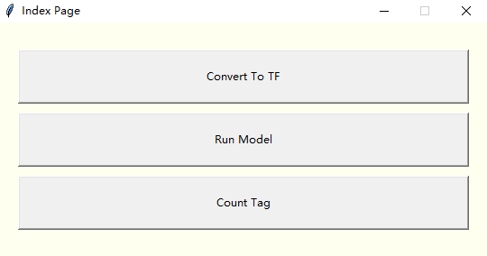

##  tk_command_gui

### 1. 说明
+ 由于懒得调用bat换参数，所以用python写了一个gui可以调用bat

### 2. 命令

+ 使用到的命令如下

  1. 转换openvino到tensorflow

     ```
     python ./mo_tf.py --input_model="{frozen_inference_graph.pb_path}" --tensorflow_use_custom_operations_config extensions/front/tf/ssd_v2_support.json --tensorflow_object_detection_api_pipeline_config {pipeline.config_path} --output="detection_boxes,detection_scores,num_detections" --output_dir={output_path} --reverse_input_channels
     ```

  2. 验证模型

     ```
     object_detection_demo_ssd_async.exe -i "{target_path}" -m {frozen_inference_graph.xml_path} -d CPU -t {rate}
     ```
     
  3. 统计VOTT标记的tag数目
  
  
### 3. 依赖

+ pip安装

  ```
  # import numpy as np
  # import networkx as nx
  # import tensorflow as tf
  ```

+ `https://software.intel.com/en-us/openvino-toolkit/documentation/get-started`

### 4. 样式

 

>只适用于window，dist下为打包好的exe. [ pyinstaller -F tkinter_gui.py ]
